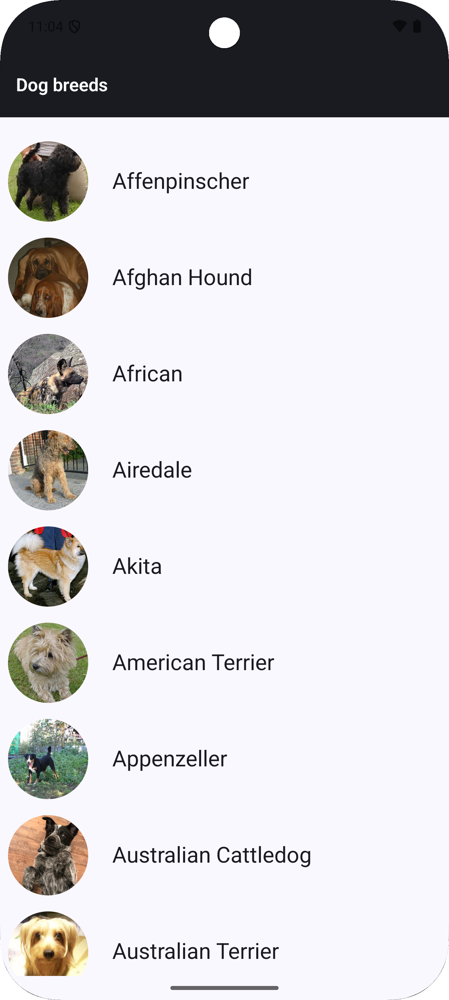
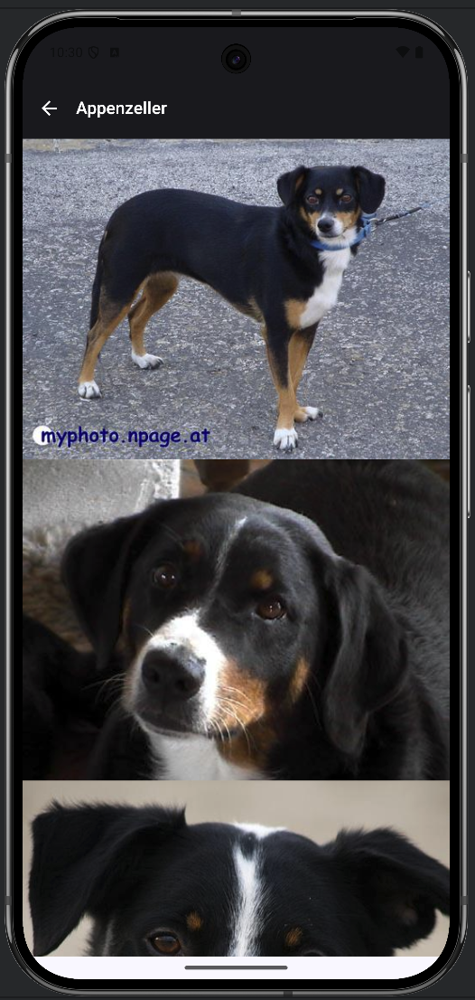

# dog-breeds

### Features
Displays list of dog breeds with breed image. Clicking on the breed list item opens breed details 
which shows 10 random images of that breed.

### Design

  
  

## Architecture
Jetpack compose for UI, MVVM viewmodel for presentation logic. Beyond presentation is an implementation 
of clean architecture. Features and core layers layers are separated in gradle module with modules for 

* feature/breeds
* feature/breeddetail
* core/domain
* core/data
* core/network
* core/common

## Testing
Unit tests have been written for viewmodel, mappers, usecases, repositories and network data sources.

## What can be done next
Snapshot testing,  UI and integration testing
Room database can be added to make app usable offline and improve network performance.
Add error retry section fot the user to be able to reload.